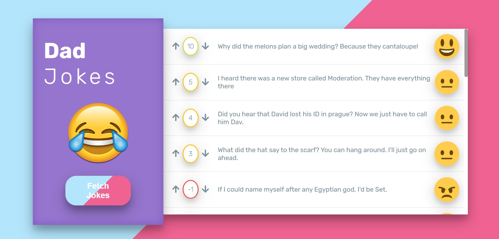

## Dad Jokes App

<b>Built with</b> 

- The app uses an API to fetch new jokes.
- Users can upvote or downvote the jokes they see.
- Jokes are stored in localStorage for easy access.

<h2><a href="https://anushkabahuguna.github.io/dad-jokes-app/">Demo</a></h2>

